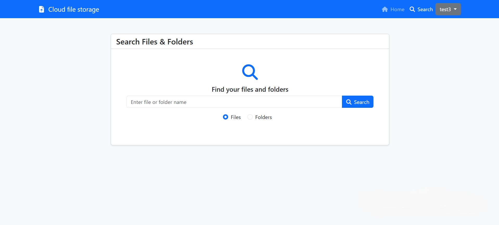

<h1 align='center'>
Cloud-file-storage project
</h1>

## Overview
This web application allows users to upload, organize, and manage their files and folders via a user-friendly interface.

Built as a full-stack Java project for educational purposes, it includes authentication, session management, and integration with S3-compatible storage.

## Key features

### Authentication
- Secure login and registration (Spring Security)
- Session management with Redis + Spring Session

### Files and folders
- Uploading single or multiple files
- Downloading, renaming files and folders
- Deleting and moving files or folders between folders
- Creating empty folders
- Searching by name

### UI
- Responsive web interface using Thymeleaf + Bootstrap 5

## Technologies Used

### Backend
- Spring Boot, Spring MVC, Spring Security
- Hibernate ORM, Spring Data JPA
- Redis (Spring Session)
- MinIO (S3-compatible object storage)
- Flyway for database migrations
- JUnit 5, Mockito

### Frontend
- Thymeleaf
- Bootstrap 5
- JavaScript, HTML, CSS

### Tools
- Maven
- Docker
- PostgreSQL 17

## Database

#### Table `Users`

| Column   | Type    | Description                 |
|----------|---------|-----------------------------|
| ID       | Int     | Auto Increment, Primary Key |
| Username | Varchar | Unique username             |
| Password | Varchar | BCrypt-encrypted password   |

## API

### Authentication

| Method | Endpoint         | Description                                                 |
|--------|------------------|-------------------------------------------------------------|
| GET    | `/auth/login`    | Returns login page                                          |
| POST   | `/auth/login`    | Authenticates user and redirects to `/home` if successful   |
| GET    | `/auth/register` | Returns registration page                                   |
| POST   | `/auth/register` | Registers a new user and redirects to `/home` if successful |
| POST   | `/auth/logout`   | Logs out the current user                                   |

### Files and folders

| Method | Endpoint           | Description                                                   |
|--------|--------------------|---------------------------------------------------------------|
| POST   | `/file/upload`     | Uploads single file                                           |
| GET    | `/file/download`   | Downloads a file                                              |
| POST   | `/file/rename`     | Renames a file                                                |
| POST   | `/file/remove`     | Removes a file                                                |
| POST   | `/file/move`       | Moves file to another folder                                  |
| POST   | `/folder/upload`   | Uploads a folder and its content (files/subfolders)           |
| GET    | `/folder/download` | Downloads a folder                                            |
| POST   | `/folder/rename`   | Renames a folder                                              |
| POST   | `/folder/remove`   | Removes a folder                                              |
| GET    | `/folder/move`     | Returns thymeleaf fragment with list of folders for selection |
| POST   | `/folder/move`     | Moves folder to another folder                                |
| POST   | `/folder`          | Creates empty folder                                          |

### Search

| Method | Endpoint                 | Description                               |
| ------ |--------------------------|-------------------------------------------|
| GET    | `/search?query=filename` | Searches files/folders by query parameter |

### Home page

| Method | Endpoint                   | Description                           |
| ------ |----------------------------|---------------------------------------|
| GET    | `/home?path=folder2%Fpath` | Returns files inside specified folder |

## Screenshots

<figure style="text-align: center;">
  
  <figcaption>Registration page</figcaption>
</figure>
<figure style="text-align: center;">
  
  <figcaption>Login page</figcaption>
</figure>
<figure style="text-align: center;">
  
  <figcaption>Home page</figcaption>
</figure>

<figure style="text-align: center;">
  
  <figcaption>Search page</figcaption>
</figure>

## Acknowledgements

- All uploaded files are stored in an S3-compatible bucket named `user-files`
- Each user has their own virtual folder inside the bucket, named `user-{id}-files`, where `{id}` is the numeric user ID
- Minio does not have folders. Folders are created based on the `/` - forward slashes in the filename
- Maximum size of one file to upload - 10 MB
- Maximum size of multiple files to upload is also - 10 MB